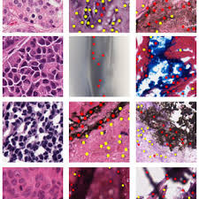
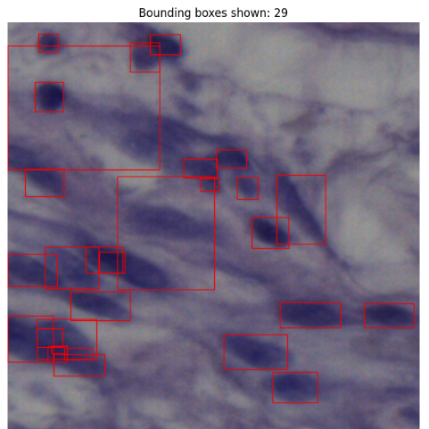
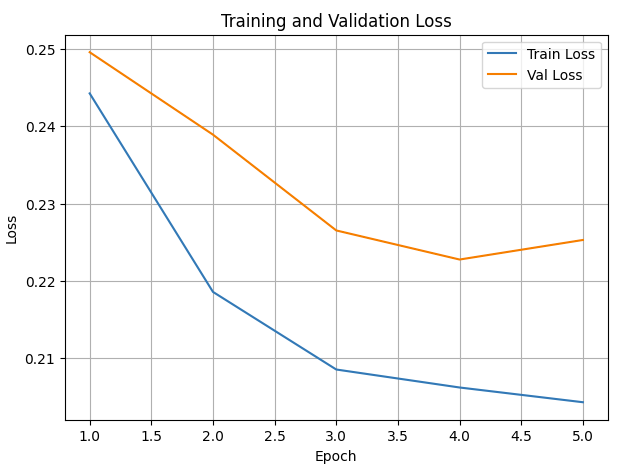
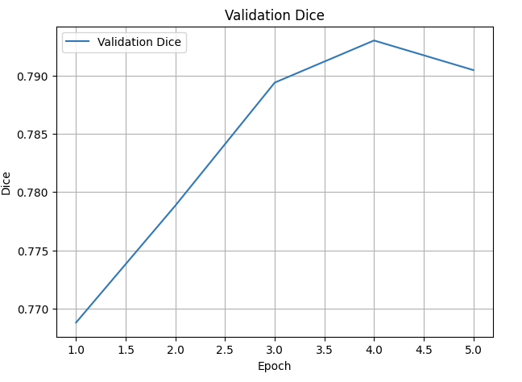
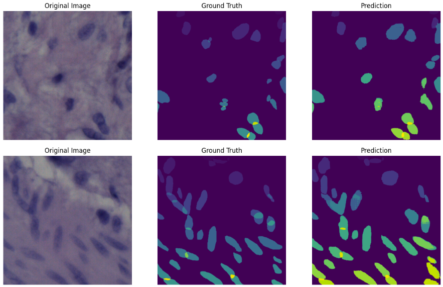
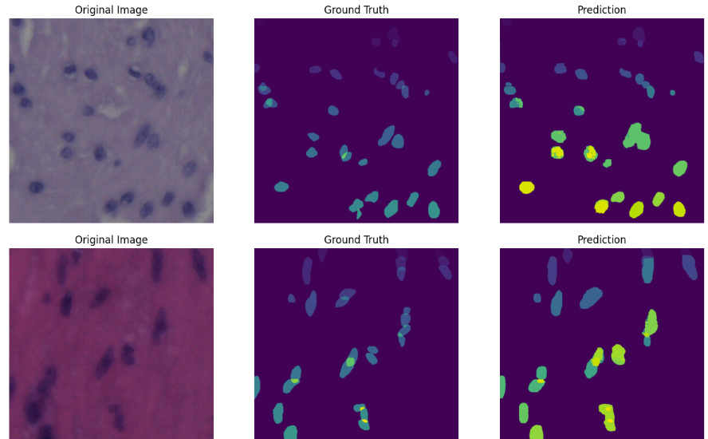
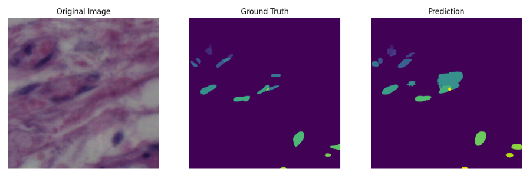
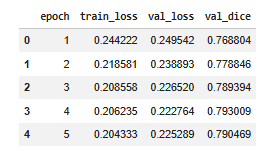

# 🧠 MobileSAM + LoRA for Nuclei Instance Segmentation

---

## 📌 Overview
This project presents a **parameter-efficient deep learning framework** for nuclei instance segmentation in histopathological images using:

- 🔹 **MobileSAM** (lightweight Segment Anything Model)
- 🔹 **LoRA (Low-Rank Adaptation)** for efficient fine-tuning

The model is trained and evaluated on the **NuInsSeg dataset** using **5-fold cross-validation**.

---

## 🚀 Key Features
- ✅ Lightweight SAM-based architecture (MobileSAM)
- ✅ Efficient fine-tuning with LoRA
- ✅ Automatic prompt generation (bounding boxes)
- ✅ Instance segmentation evaluation (Dice, AJI, PQ)
- ✅ Cross-validation for robust results

---

## 🗂️ Dataset (NuInsSeg)

The dataset includes:

| Component | Description |
|----------|------------|
| Tissue Images | H&E histopathology images |
| Label Masks | Instance-level annotations |
| Binary Masks | Foreground segmentation |
| Boundary Maps | Nuclei borders |
| Distance Maps | Pixel-wise distance encoding |



---

## 🧠 Methodology

### Pipeline
```
Image → Bounding Boxes → MobileSAM + LoRA → Mask Decoder → Predictions
```

### Steps
1. Preprocess images (resize, normalize)
2. Extract bounding boxes from masks
3. Apply LoRA to attention layers
4. Train using BCE + Dice loss
5. Evaluate with Dice, AJI, PQ

---

## 📊 Results










